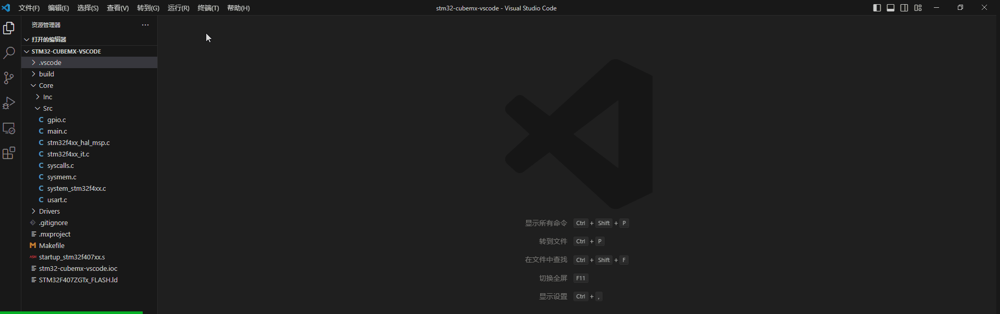
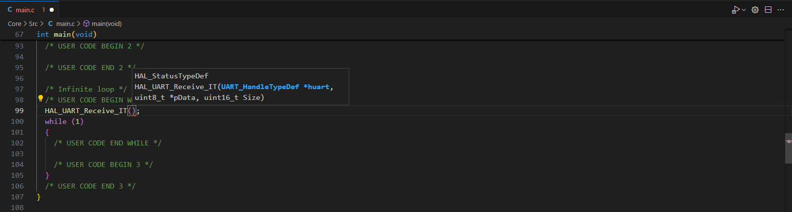
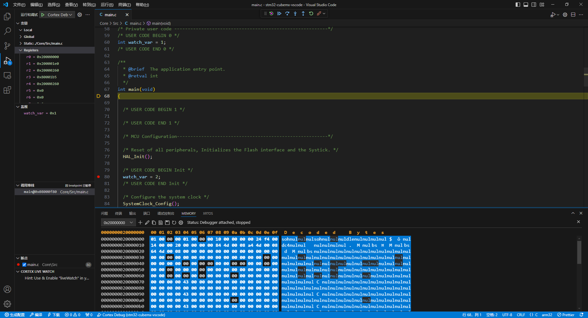
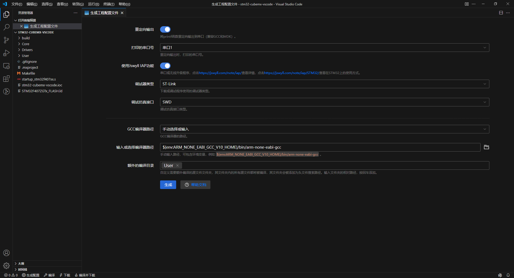
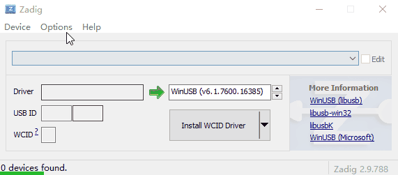
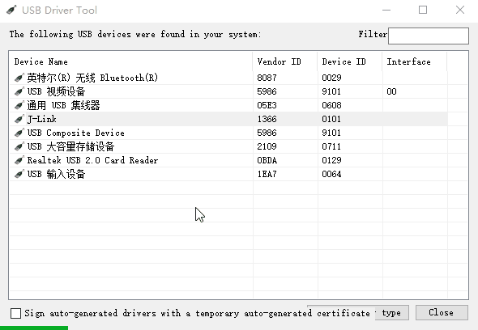

# vscode扩展 - STM32工程助手

> 本vscode扩展适用于使用STM32CubeMX生成的工程，用于生成vscode的代码浏览、编辑、编译、下载、调试的配置。
>
> 作者：[jswyll](https://jswyll.com/)，文档链接：<https://jswyll.com/note/embed/jswyll-stm32-assistant/>。

## 软件特性

- 生成`.vscode/tasks.json`配置文件，便于按快捷键[使用GCC编译器编译、下载代码](https://jswyll.com/note/embed/stm32/#%E4%BD%BF%E7%94%A8gcc%E7%BC%96%E8%AF%91)

    

    > **说明**
    >
    > 支持Jlink、CMSIS-DAP、ST-Link调试器。

- 生成`.vscode/c_cpp_properties.json`配置文件，便于在VSCode浏览、编辑STM32CubeMX生成的工程代码

    

- 在`Core/Src/main.c`中生成同时适用于Keil MDK和GCC编译器的重定向函数

- 优化Makefile类型的编译输出：

    ```sh
    compiling Core/Src/sysmem.c...
    compiling Core/Src/syscalls.c...
    compiling startup_stm32f407xx.s...
    linking...
    text    data     bss     dec     hex filename
    21592     488    1664   23744    5cc0 build/工程名称.elf
    ```

- 生成`.vscode/launch.json`配置文件，可用于启动（快捷键F5）Cortex-Debug调试：

    

    > **说明**
    >
    > 这个功能由Cortex-Debug扩展提供，本扩展仅负责生成配置文件。

- 生成适用于[Jswyll IAP在线升级调试](https://jswyll.com/note/iap/)的代码

## 快速开始

1. 使用VSCode打开用STM32CubeMX生成的工程的主目录，即xxx.ioc文件所在的文件夹

2. 点击VSCode状态栏的`生成配置`图标按钮，根据引导，生成配置文件。

    

3. 浏览代码；点击状态栏按钮进行编译或下载；按F5键进行调试程序……

> **说明**
>
> 如果你使用的调试器是JLink，有两种选择：
>
> 1. 使用使用JLink驱动直接下载程序，缺点是不能调试程序，需要[安装JLink软件包](https://www.segger.com/downloads/jlinkJLink_Windows_V792_x86_64.exe)。
>
> 2. 使用[OpenOCD](https://sysprogs.com/getfile/2285/openocd-20240916.7z)下载或调试程序，需要使用[Zadig](https:/github.com/pbatard/libwdi/releases/download/v1.5.1/zadig-2.9.exe)把Jlink的驱动改为winusb：
>
>     
>
>     修改驱动后在MDK就不能使用JLink下载了，可以使用[OpenOCD](https://sysprogs.com/getfile/2285/openocd-20240916.7z里的)UsbDriverTool.exe把驱动恢复为JLlink驱动：
>
>     

## 已知问题

- 已经生成配置后，再次生成配置时选择的串口和原来的不一样时，需要手动修改打印重定向的hal串口编号

## 实现原理

- 从当前工作区下的`.ioc`文件中提取MCU型号、工程名称

- 如果当前工作区下存在`Makefile`文件，则修改`Makefile`文件：

    1. 在`LIBS = -lc -lm -lnosys`这行添加`-u _printf_float`以支持浮点打印；
  
    2. 在`$(BUILD_DIR)/%.o: %.c Makefile | $(BUILD_DIR)`的下一行添加`@echo compiling $<...`（显示正在编译的源文件）；

    3. 在链接目标`$(BUILD_DIR)/$(TARGET).elf: $(OBJECTS) Makefile`的下一行添加`@echo linking...`（提示正在链接）；

    4. 在`$(CC)`、`$(AS)`、`$(SZ)`、`$(HEX)`、`$(BIN)`指令前添加`@`（屏蔽命令及其参数的输出）

    5. 在`LDSCRIPT = xxx.ld`上方添加一行`MYLINKSCRIPT = .vscode/linkscript.ld`；根据是否使用IAP功能来切换`LDFLAGS = ...`中的`-T`参数是默认的`$(LDSCRIPT)`还是`$(MYLINKSCRIPT)`。

- 当前工作区下的`.vscode/c_cpp_properties.json`文件改为：

    ```json
    {
        "configurations": [
            {
                "name": "arm32",
                "compilerPath": "选择的GCC路径",
                "cStandard": "c99",
                "cppStandard": "c++11",
                "defines": [
                    "USE_HAL_DRIVER",
                    "使用的MCU型号类"
                ],
                "includePath": [
                    "${workspaceFolder}/**"
                ],
                "intelliSenseMode": "gcc-arm"
            }
        ],
        "version": 4
    }
    ```

    其中，defines的宏定义从当前工作区的Makefile文件（如果有）中提取。

- 修改当前工作区下的`Core/Src/main.c`文件，添加打印重定向函数：

    1. 插入`#include <stdio.h>`

    2. 在`/* USER CODE BEGIN 4 */`和`/* USER CODE END 4 */`之间插入代码：

    ```c
    #if defined(__CC_ARM) || defined(__CLANG_ARM) || defined(__ARMCC_VERSION)
    int fputc(int ch, FILE *f)
    {
      HAL_UART_Transmit(&huart1, (uint8_t *)&ch, 1, HAL_MAX_DELAY);
      return ch;
    }
    #elif defined(__GNUC__)
    #define STDOUT_FILENO 1
    #define STDERR_FILENO 2

    int _write(int file, char *ptr, int len)
    {
      switch (file)
      {
      case STDOUT_FILENO:
        HAL_UART_Transmit(&huart1, (uint8_t *)ptr, len, HAL_MAX_DELAY);
        break;

      case STDERR_FILENO:
        break;

      default:
        return -1;
      }
      return len;
    }
    #endif
    ```

- 如果使用IAP功能：

    1. 复制当前工作区下的`xxx.ld`到`.vscode/linkscript.ld`，并将FLASH地址改为APP区起始地址；

    2. 将当前工作区下的`Core/Src/system_stm32xxx.c`中的`/*#define USER_VECT_TAB_ADDRESS*/`取消注释，并修改`#define VECT_TAB_OFFSET         APP区起始地址`

    3. 修改当前工作区下的`Core/Src/main.c`文件：

        ```c
        /* USER CODE BEGIN PV */
        static uint8_t uart1_recv_byte;
        /* USER CODE END PV */

        int main(void)
        {
            ...

            /* USER CODE BEGIN WHILE */
            HAL_UART_Receive_IT(&huart1, &uart1_recv_byte, 1);
            while (1)
            {
                /* USER CODE END WHILE */

                ...
            }
        }
        
        void HAL_UART_RxCpltCallback(UART_HandleTypeDef *huart)
        {
          if (huart->Instance == USART1)
          {
            if (uart1_recv_byte == 0xfe)
            {
              HAL_NVIC_SystemReset();
            }

            HAL_UART_Receive_IT(&huart1, &uart1_recv_byte, 1);
          }
        }
        ```

- 修改`.vscode/tasks.json`文件，添加编译、下载、调试的运行任务

- 修改`.vscode/launch.json`文件，添加Cortex Debug启动配置

    ```json
    {
        "version": "0.2.0",
        "configurations": [
            {
                "name": "Cortex Debug",
                "cwd": "${workspaceFolder}",
                "executable": "${workspaceFolder}/build/工程名称.elf",
                "request": "launch",
                "type": "cortex-debug",
                "runToEntryPoint": "main",
                "servertype": "openocd",
                "configFiles": [
                    "${workspaceFolder}/.vscode/openocd.cfg"
                ],
                "device": "MCU型号",
                "interface": "swd",
                "preLaunchTask": "build"
            }
        ]
    }
    ```
