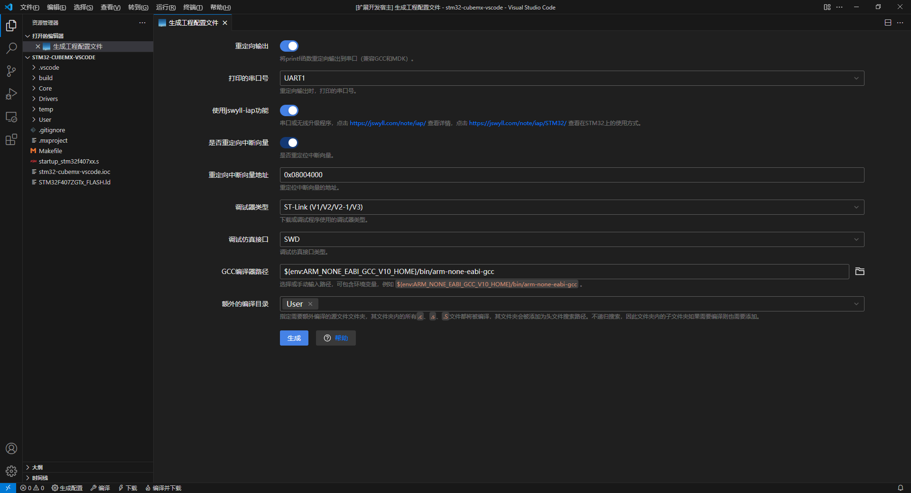
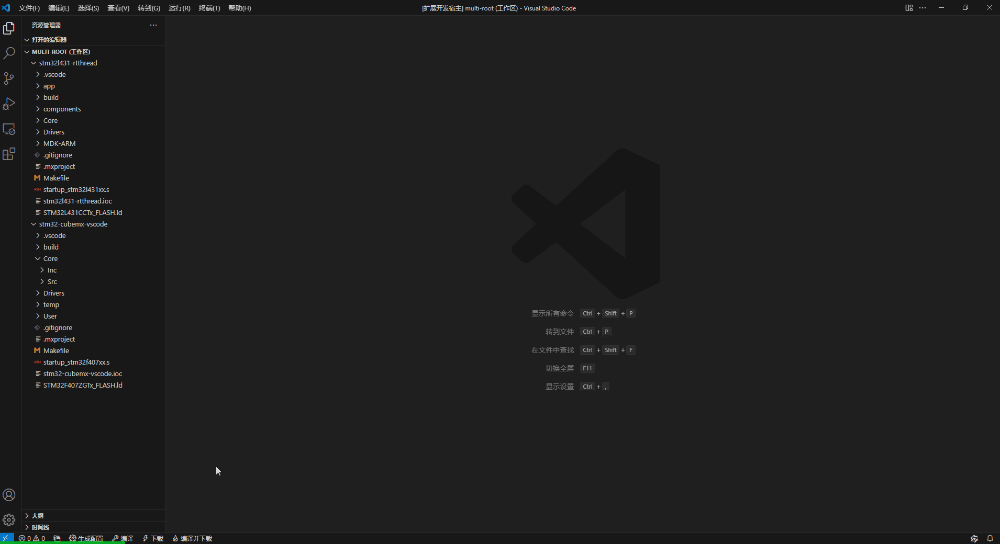
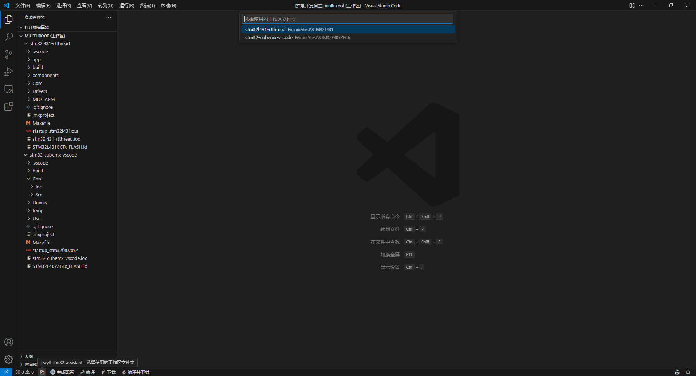
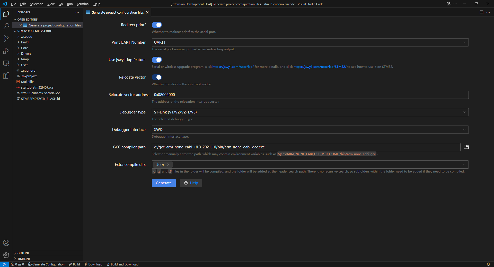
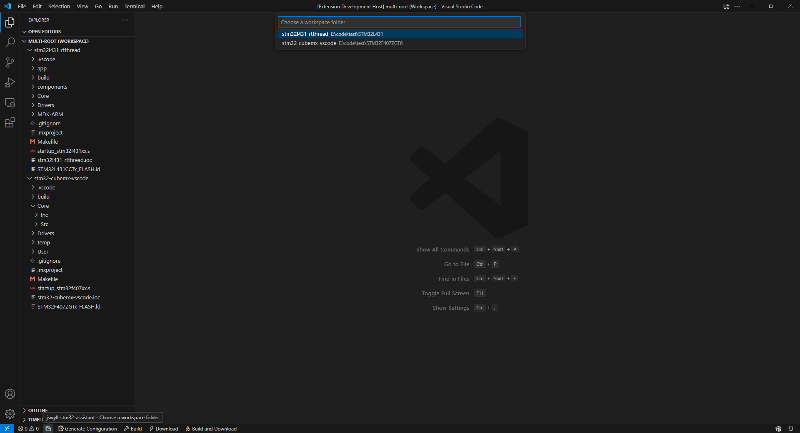

# vscode扩展 - STM32工程助手

[English](#quick-start) | 简体中文

> 本vscode扩展适用于使用STM32CubeMX生成的工程，用于生成vscode的代码浏览、编辑、编译、下载、调试的配置文件。
>
> 作者：[jswyll](https://jswyll.com/)，文档链接：<https://jswyll.com/note/embed/jswyll-stm32-assistant/>。

## 快速开始

1. 使用VSCode打开用STM32CubeMX生成的工程的主目录，即xxx.ioc文件所在的文件夹

2. 点击VSCode状态栏的`生成配置`图标按钮，根据引导，生成配置文件。

    

3. 浏览代码；点击状态栏按钮进行编译或下载；按F5键进行调试程序……

## 软件特性

- 生成`.vscode/tasks.json`配置文件，便于按快捷键[使用GCC编译器编译、下载代码](https://jswyll.com/note/embed/stm32/#%E4%BD%BF%E7%94%A8gcc%E7%BC%96%E8%AF%91)

    

    > **说明**
    >
    > 支持Jlink、CMSIS-DAP、ST-Link调试器。

- 生成`.vscode/c_cpp_properties.json`配置文件，便于在VSCode浏览、编辑STM32CubeMX生成的工程代码

    

- 在`Core/Src/main.c`中生成同时适用于Keil MDK和GCC编译器的重定向函数

- 优化Makefile类型的编译输出：

    ```sh
    compiling Core/Src/sysmem.c...
    compiling Core/Src/syscalls.c...
    compiling startup_stm32f407xx.s...
    linking...
    text    data     bss     dec     hex filename
    21592     488    1664   23744    5cc0 build/工程名称.elf
    ```

- 生成`.vscode/launch.json`配置文件，可用于启动（快捷键F5）Cortex-Debug调试：

    

    > **说明**
    >
    > 这个功能由Cortex-Debug扩展提供，本扩展仅负责生成配置文件。

- [多根工作区](#多根工作区)

- 生成适用于[jswyll-iap在线升级调试](https://jswyll.com/note/iap/)的代码

> **说明**
>
> 如果你使用的调试器是JLink，有两种选择：
>
> 1. 使用使用JLink驱动直接下载程序，缺点是不能调试程序，需要[安装JLink软件包](https://www.segger.com/downloads/jlinkJLink_Windows_V792_x86_64.exe)。
>
> 2. 使用[OpenOCD](https://sysprogs.com/getfile/2285/openocd-20240916.7z)下载或调试程序，需要使用[Zadig](https:/github.com/pbatard/libwdi/releases/download/v1.5.1/zadig-2.9.exe)把Jlink的驱动改为winusb：
>
>     
>
>     修改驱动后在MDK就不能使用JLink下载了，可以使用[OpenOCD](https://sysprogs.com/getfile/2285/openocd-20240916.7z里的)UsbDriverTool.exe把驱动恢复为JLlink驱动：
>
>     

## 多根工作区

vscode支持[多根工作区](https://code.visualstudio.com/docs/editor/multi-root-workspaces)，可以在一个工作区中同时打开多个工程。

本扩展兼容多根工作区。当你打开了一个多根工作区，点击状态栏的操作按钮时，首次将弹出提示选择当前操作的是哪个工作区文件夹：



后续的操作都将基于该工作区文件夹，相关的配置文件会保存在该工作区文件夹。

> **说明**
>
> 你可以点击状态栏的`子文件夹`图标，切换当前工作区文件夹：
>
> 

================================================================================

================================================================================

================================================================================

English | [简体中文](#快速开始)

> This vscode extension is suitable for projects generated using STM32CubeMX, used to generate vscode code browsing, editing, compiling, downloading, debugging configuration files.
>
> Author: jswyll, link to documentation: <https://jswyll.com/note/embed/jswyll-stm32-assistant/>.

## Quick Start

1. Open the main directory of the project generated by STM32CubeMX using VSCode, i.e., the folder where the `xxx.ioc` file is located.

2. Click the `Generate Configuration` icon button in the VSCode status bar, and follow the prompts to generate the configuration file.

    

3. Browse the code; click the status bar button to compile or download; press F5 to debug the program...

## Software Features

- Generates a `.vscode/tasks.json` configuration file for easy compilation and downloading using the GCC compiler.

    

    > **Note**
    >
    > Supports Jlink, CMSIS-DAP, and ST-Link debuggers.

- Generates a `.vscode/c_cpp_properties.json` configuration file for browsing and editing the code generated by STM32CubeMX in VSCode.

    

- Generates redirect functions in `Core/Src/main.c` that are compatible with both Keil MDK and GCC compilers.

- Optimizes Makefile-type compilation output:

    ```sh
    compiling Core/Src/sysmem.c...
    compiling Core/Src/syscalls.c...
    compiling startup_stm32f407xx.s...
    linking...
    text    data     bss     dec     hex filename
    21592     488    1664   23744    5cc0 build/project_name.elf
    ```

- Generates a `.vscode/launch.json` configuration file for starting (F5 shortcut) Cortex-Debug debugging:

    

    > **Note**
    >
    > This feature is provided by the Cortex-Debug extension; this extension only generates the configuration file.

- [Multi-root Workspaces](#multi-root-workspaces)

- Generates code suitable for [jswyll-iap online upgrade debugging](https://jswyll.com/note/iap/)

> **Note**
>
> If you are using a JLink debugger, you have two options:
>
> 1. Use the JLink driver to directly download the program. The downside is that you cannot debug the program. You need to [install the JLink software package](https://www.segger.com/downloads/jlinkJLink_Windows_V792_x86_64.exe).
>
> 2. Use [OpenOCD](https://sysprogs.com/getfile/2285/openocd-20240916.7z) to download or debug the program. You need to use [Zadig](https://github.com/pbatard/libwdi/releases/download/v1.5.1/zadig-2.9.exe) to change the JLink driver to winusb:
>
>     
>
>     After modifying the driver, you cannot use JLink to download in MDK. You can use [UsbDriverTool.exe](https://sysprogs.com/getfile/2285/openocd-20240916.7z) to restore the driver to JLink:
>
>     

## Multi-root Workspaces

VSCode supports [multi-root workspaces](https://code.visualstudio.com/docs/editor/multi-root-workspaces), allowing multiple projects to be opened simultaneously in one workspace.

This extension is compatible with multi-root workspaces. When you open a multi-root workspace and click the status bar operation button, a prompt will appear the first time to select which workspace folder the current operation should apply to:


Subsequent operations will be based on the selected workspace folder, and related configuration files will be saved in that folder.

> **Note**
>
> You can click the `Subfolder` icon in the status bar to switch the current workspace folder:
>
> 
